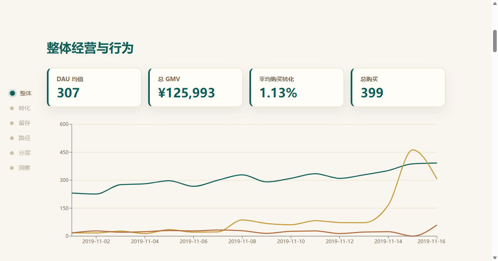

# 电商 App 用户行为路径与转化留存分析项目

[](https://github.com/jiang4wqy/ecommerce-user-path-retention/actions/workflows/tests.yml)
[](https://github.com/jiang4wqy/ecommerce-user-path-retention/actions/workflows/deploy-pages.yml)
[](https://jiang4wqy.github.io/ecommerce-user-path-retention/)

一个面向数据分析、商业分析、产品分析和运营分析岗位的作品集项目。项目使用公开匿名化电商行为日志，分析用户从浏览、加购到购买和复访的行为路径，并把分析结果转化为产品与运营建议。

## 在线演示

- **数据故事页（推荐）**：<https://jiang4wqy.github.io/ecommerce-user-path-retention/> — 暖调轻奢配色、滚动叙事、漏斗与留存随滚动逐级点亮的只读展示页（Vite + React + Framer Motion + Recharts），由 GitHub Pages 自动部署。
- **交互工作台**：本地运行 Streamlit dashboard（见下方「本地运行」），支持日期/品类/品牌/价格实时筛选。

> 两者读取同一套已算好的指标，数字一致：Streamlit 用于交互分析，故事页用于对外展示。

## 项目亮点

- **真实公开数据**：使用 REES46 / Kaggle 多品类电商行为数据的公开镜像，不使用虚拟数据。
- **后端分析链路**：数据拉取、清洗、质量检查、DuckDB SQL 指标层、Python 深度分析。
- **前端展示层**：Streamlit + Plotly 交互式 dashboard，支持日期、品类、品牌和价格筛选。
- **面试材料完整**：包含 README、指标 SQL、数据质量报告、洞察报告、简历 bullet 和面试讲稿。

## 架构

```text
Public Dataset API
      |
      v
src/data_source.py        # 按用户抽样（DuckDB 读公开 parquet）+ rows API 备用
      |
      v
src/prepare_data.py       # 清洗、时间字段、CSV/Parquet 输出
      |
      v
src/build_database.py     # 生成 analytics.duckdb 与指标表
      |
      v
sql/*.sql + src/*.py      # KPI、漏斗、留存、路径、分层、价格带、session 深度
      |
      v
app/dashboard.py          # Streamlit 前端展示、筛选器、图表解释
```

## 数据来源

原始数据来自 REES46 / Kaggle 的 multi-category ecommerce behavior dataset，字段包括：

`event_time`, `event_type`, `product_id`, `category_code`, `brand`, `price`, `user_id`, `user_session`

参考链接：

- [Kaggle: Ecommerce behavior data from multi category store](https://www.kaggle.com/datasets/mkechinov/ecommerce-behavior-data-from-multi-category-store)
- [REES46 Datasets](https://rees46.com/en/datasets)
- [Hugging Face mirror used for reproducible sample rows](https://huggingface.co/datasets/kevykibbz/ecommerce-behavior-data-from-multi-category-store_oct-nov_2019)

当前样本通过 DuckDB 直读 Hugging Face 公开 parquet 镜像，并按 `user_id` 哈希抽取整段用户（保留每个用户的完整事件序列），包含 41,944 条真实公开事件、2,536 个用户、8,048 个 session，覆盖 2019-11-01 至 2019-11-16。按用户抽样保证 session、漏斗、路径和留存分析建立在完整用户旅程上，而不是被切碎的片段。

## 技术栈

- Python: pandas
- SQL: DuckDB
- Dashboard: Streamlit
- Visualization: Plotly
- Data format: CSV, Parquet, DuckDB
- Tests: pytest
- Delivery audit: project hygiene check before GitHub upload

## 项目结构

```text
app/dashboard.py                 # 前端 dashboard
src/data_source.py               # 数据源 API
src/prepare_data.py              # 数据清洗与样本输出
src/data_quality.py              # 数据质量检查
src/build_database.py            # DuckDB 指标库生成
src/metric_store.py              # SQL 指标读取层
src/filters.py                   # dashboard 筛选逻辑
src/project_audit.py             # GitHub 交付前项目审计
src/advanced_analysis.py         # 价格带、session 深度、购买路径等增强分析
src/charts.py                    # Plotly 图表
src/insights.py                  # 自动业务洞察
sql/*.sql                        # 指标 SQL
reports/                         # 洞察、数据质量、面试与简历材料
tests/                           # 单元测试
```

## 本地运行

安装依赖：

```bash
pip install -r requirements.txt
```

一键跑完整 pipeline：

```powershell
.\run_pipeline.ps1
```

默认使用项目内已抽样的真实公开数据，避免每次演示都依赖网络。需要重新从公开数据源拉取样本时运行：

```powershell
.\run_pipeline.ps1 -RefreshData
```

单独运行：

```bash
python -m src.prepare_data --rows 40000          # 默认 hf_users：DuckDB 按用户抽样
python -m src.build_database
python -m src.export_outputs
python -m pytest -q -p no:cacheprovider
python -m src.project_audit
python -m streamlit run app/dashboard.py
```

Windows 启动 dashboard：

```powershell
.\run_dashboard.ps1
```

## Dashboard 页面

- **Overview**：核心 KPI、趋势、数据质量和样本数据。
- **Conversion**：`view -> cart -> purchase` 漏斗、价格带转化、加购放弃。
- **Retention**：D0/D1/D3/D7 cohort 留存热力图。
- **User Path**：Top session path、购买路径与未购买路径对比。
- **Segments**：浏览型、加购未买型、购买型、复购型用户分层，品类和 session 深度。
- **Insights**：自动生成的业务洞察和优化建议。

## 预览

数据故事页（在线版：<https://jiang4wqy.github.io/ecommerce-user-path-retention/>）：

[](https://jiang4wqy.github.io/ecommerce-user-path-retention/)

## 数据故事页（独立前端）

`web/` 是一个 Vite + React + TypeScript 的只读「数据故事」展示页，读取由 `python -m src.export_web_data` 烘焙的 `web/src/data/metrics.json`（与 Streamlit 用同一套指标，保证数值一致）。它用长卷滚动叙事 + 进度轴为骨架，漏斗与留存两个板块用「钉图」随滚动逐级点亮，配色为暖调轻奢。

```bash
cd web
npm install
npm run dev      # 本地预览
npm run build    # 生产构建到 web/dist
npm run test     # 组件冒烟测试 (Vitest)
```

数据刷新：在项目根运行 `python -m src.export_web_data`（已纳入 `run_pipeline.ps1`）。

## 当前样本关键发现

- 漏斗：浏览用户 2,536 → 加购 459（18.1%）→ 购买 165（整体 6.5%）；浏览到加购流失约 82%，加购到购买转化约 36%。
- 加购放弃率约 64%，加购未买用户适合做价格提醒、优惠触达和购物车召回。
- 留存（按首访日）：D1 约 13.5%、D3 约 7.2%、D7 约 6.2%，回访主要集中在首访后一周内。
- `electronics.smartphone` 贡献最高 GMV（约 8.9 万），适合做推荐位和活动资源倾斜。
- 最大群体为 Browsers Only（2,018 人），购买与复购用户共约 224 人，是精细化运营的重点对象。
- 购买 session 的行为深度通常高于未购买 session，可用于设计商品详情页和推荐策略。

## 面试解释口径

这个项目不是为了证明我有企业内部 App 数据，而是用公开匿名化行为日志复现产品数据分析的常见工作流：从事件数据清洗、SQL 指标加工，到漏斗、留存、路径和用户分层分析，再到 dashboard 展示和产品运营建议。
